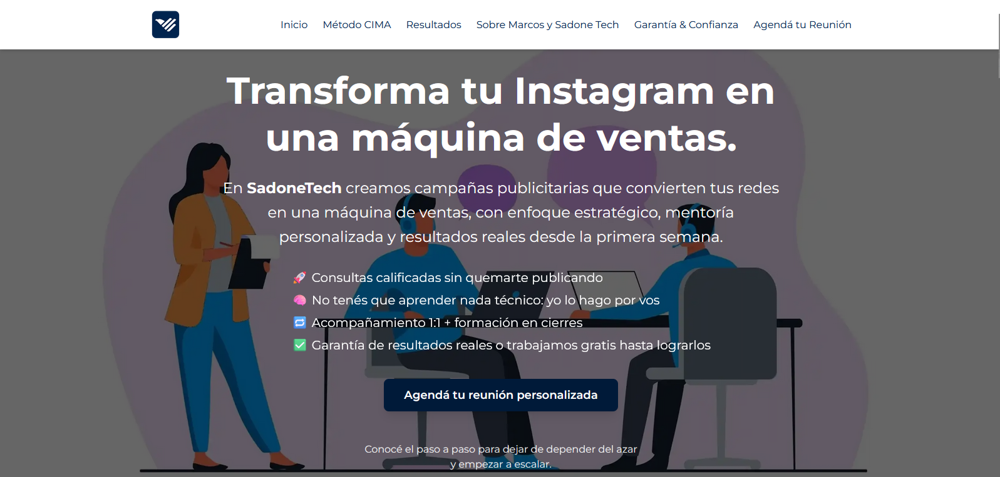
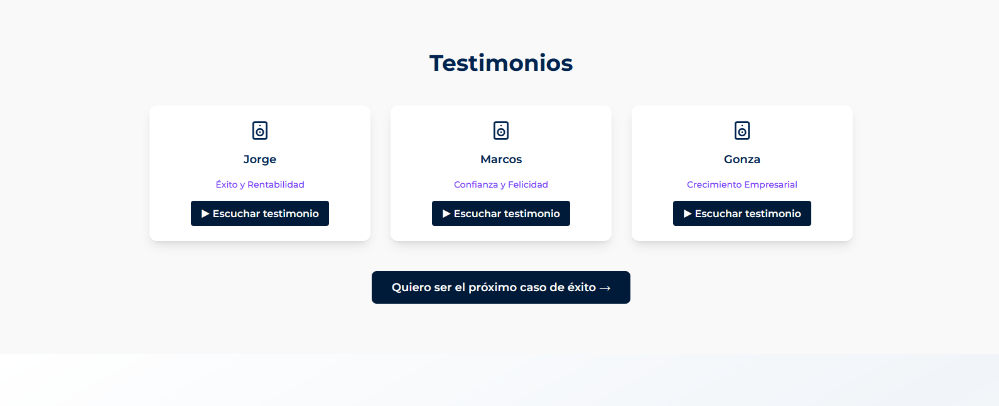
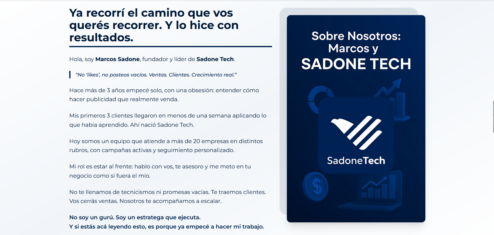
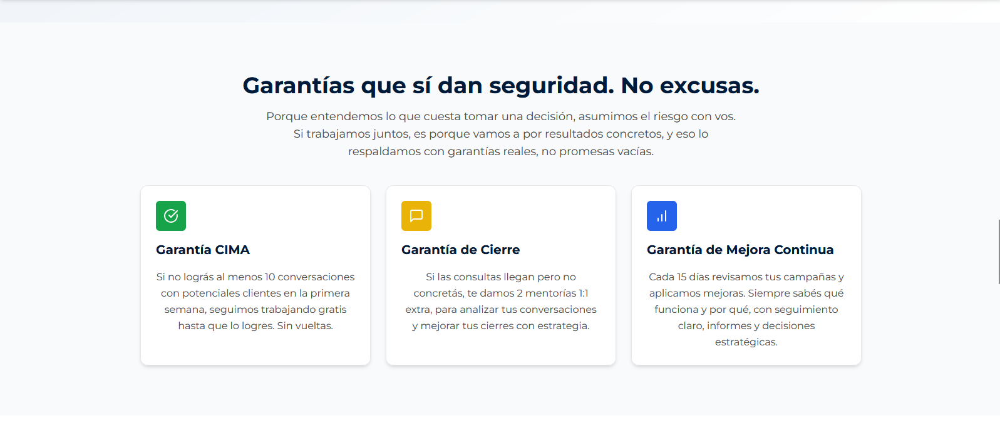
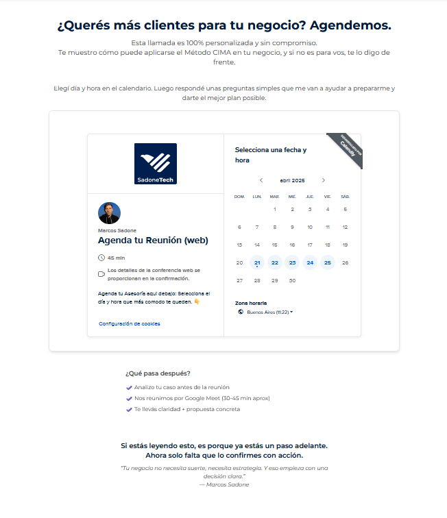
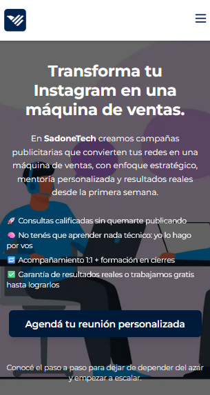

# SadoneTech 

---

## 🛠️ Características del Proyecto

### **Landing Page**
La landing page está diseñada para captar la atención de los usuarios y generar conversiones mediante formularios y CTA claros.

### **Método CIMA**
En esta sección, explicamos el enfoque estratégico que incluye **Testeo**, **Optimización** y **Escalado**. Cada fase tiene su propia sección con detalles sobre cómo implementamos cada paso.

### **Resultados**
Apartado con audios a modo de testimonio, de clientes satisfechos con el servicio ofrecido.

### **Sobre Marcos**
Contamos un poco sobre el creador de SadoneTech.

### **Garantías**
Ofrecemos garantías claras que respaldan nuestro compromiso con los resultados. Si no alcanzas las metas acordadas, continuamos trabajando gratis hasta lograrlo.

### **CTA**
Calendario para agendar una reunión!

---

## 🖼️ Diseño

El diseño de la página está optimizado para dispositivos móviles y de escritorio, las imágenes utilizadas están comprimidas y cargan de manera eficiente para mejorar el rendimiento.

---

## 🚀 Despliegue

### Despliegue en producción
Puedes ver la versión en producción de este proyecto en el siguiente enlace:

[https://sadone-tech.vercel.app](https://sadone-tech.vercel.app)

---

## 🧑‍💻 Tecnologías Utilizadas

- **React**
- **Vite**
- **Tailwind CSS**
- **TypeScript**
- **React Router**
- **Lucide Icons**

---

## Contacto

Si te interesan mis servicios, no dudes en ponerte en contacto!

- **Email**: brunoce2003@gmail.com
- **LinkedIn**: [Bruno Cé](https://www.linkedin.com/in/bruno-ce/)
